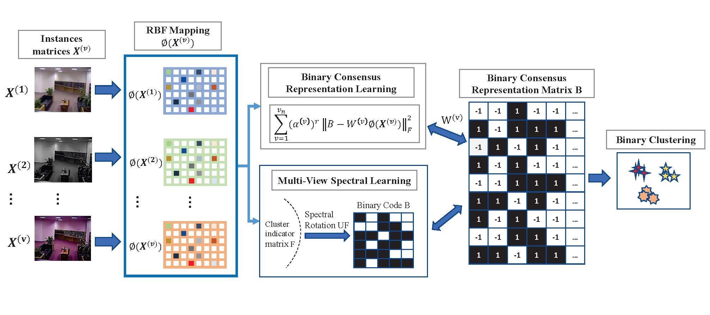

# BMVC_SE-Neurocomputing

## Binary multi-view clustering with spectral embedding

The official code of the paper " *Binary multi-view clustering with spectral embedding
*", which is accepted by "Neurocomputing". [BMVC_SE](https://doi.org/10.1016/j.neucom.2023.126733)

## Abstract

Techniques for large-scale multi-view clustering have attracted increasing attention in recent years. To explore complementary and consensus information across multiple views, mapping multi-view data into a hamming space for binary multi-view learning is highly effective. However, for binary multi-view clustering, it is difficult to adopt the local manifold structure of original data into the consensus representation. Therefore, a novel algorithm named Binary Multi-View Clustering With Spectral Embedding (BMVC_SE) is proposed in this study. This algorithm unifies binary consensus representation learning and multi-view spectral learning into a joint framework. Specifically, this algorithm exploits the shareable and individual information across multi-view data to learn a binary consensus representation. Furthermore, spectral rotation technique is employed to embed manifold information from original multi-view data into binary consensus representation. Note that a multi-view GPI algorithm is proposed in this study to obtain the better local manifold information. We also provide an effective optimization method to solve the existing method. Extensive experimental results show that our method outperforms some state-of-the-art methods.


## Overview



## Citation

If you find this code useful, don't forget to star the repo and cite the paper:

```
@article{MA2023126733,
title = {Binary multi-view clustering with spectral embedding},
journal = {Neurocomputing},
volume = {557},
pages = {126733},
year = {2023},
issn = {0925-2312},
doi = {https://doi.org/10.1016/j.neucom.2023.126733},
url = {https://www.sciencedirect.com/science/article/pii/S0925231223008561},
author = {Zeqi Ma and Wai Keung Wong and Li-ying Zhang},
keywords = {Binary multi-view, Spectral rotation},
}
```


## Acknowledgements

We thank the great works [Multi-view_Clustering](https://github.com/youweiliang/Multi-view_Clustering), [Partial-Multi-View-Clustering](https://github.com/chaytonmin/Partial-Multi-View-Clustering), [MatlabFunc](https://github.com/ZJULearning/MatlabFunc), [ELM-MVClustering](https://github.com/frash1989/ELM-MVClustering), [BMVC](https://github.com/DarrenZZhang/TPAMI19_BMVC) for providing assistance for our research.